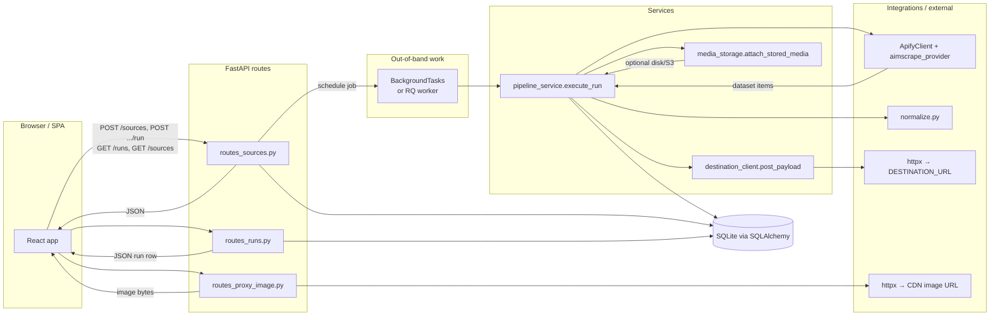
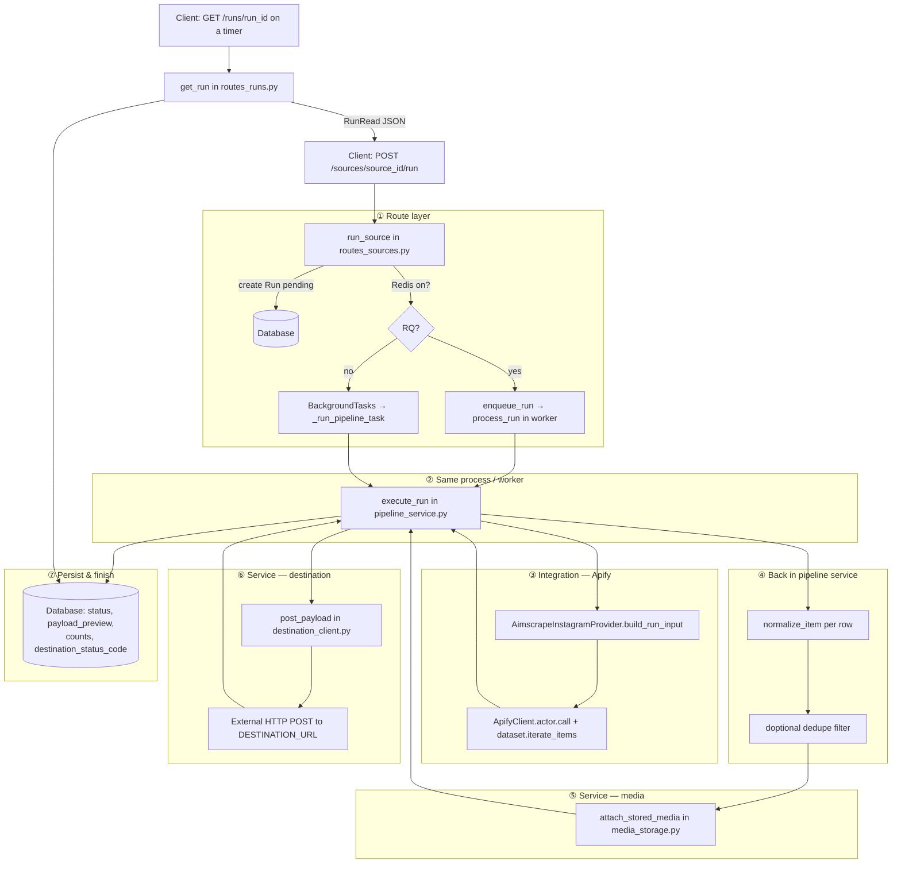
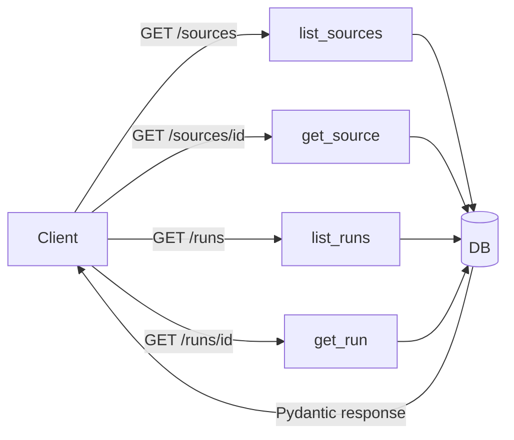

# Backend code flow (routes → services → integrations)

How a request moves through **FastAPI routes**, **services**, **external integrations**, and back to the **client**. File names point to the real code.

---

## 1. Big picture: client ↔ API ↔ work ↔ client

---

## 2. Start a run: `POST /sources/{id}/run` (vertical detail)

Numbers match the general order of operations inside `execute_run`.

---

## 3. Read-only routes (no pipeline)

---

## 4. Thumbnail proxy: `GET /proxy/cdn-image`

---

## File cheat sheet

| Layer | Files |
|--------|--------|
| **Routes** | `app/api/routes_sources.py`, `routes_runs.py`, `routes_proxy_image.py` |
| **Orchestration** | `app/services/pipeline_service.py` (`execute_run`) |
| **HTTP side effects** | `app/services/destination_client.py`, `app/services/media_storage.py` |
| **Apify wiring** | `app/integrations/apify/aimscrape_provider.py`, `normalize.py` |
| **Async entry** | `routes_sources._run_pipeline_task` / `app/jobs/tasks.process_run` + `jobs/queue.enqueue_run` |

For product-level architecture (optional queue, storage, trust), see [system-design.md](./system-design.md).
