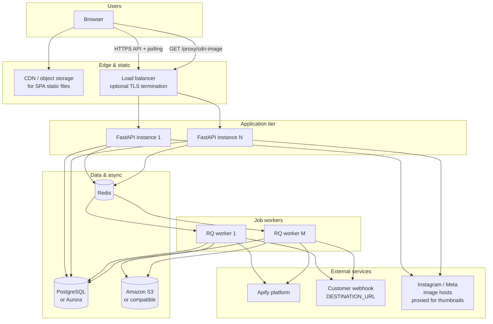
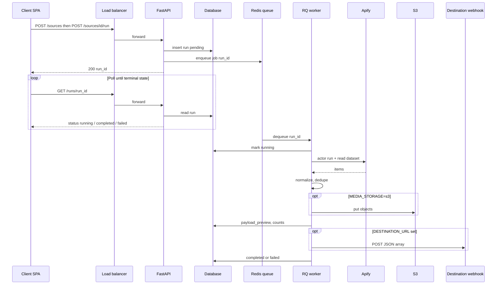
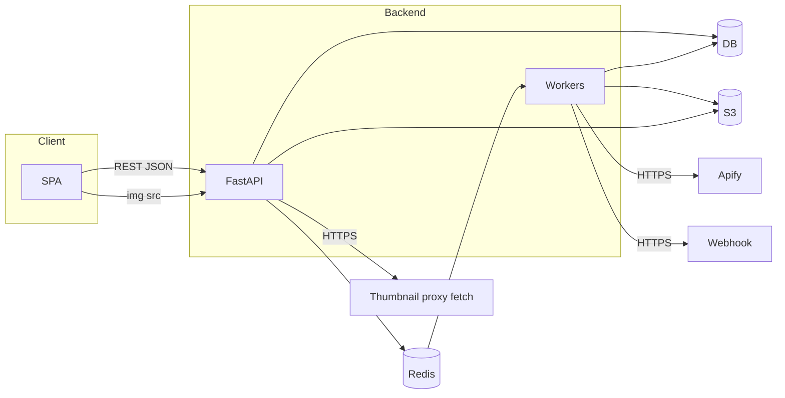
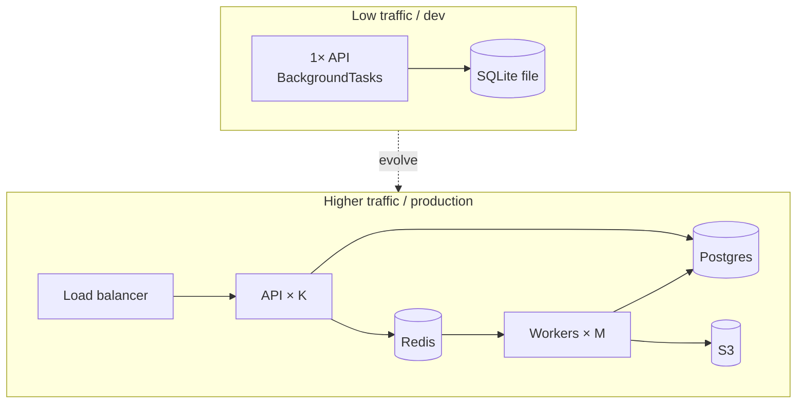

# Production system design — architecture & scaling

End-to-end view of this application as a **production-style** deployment: how the **client**, **API**, **database**, **Redis**, **workers**, **object storage**, and **external services** connect, and how you **scale** when load grows.

For day-to-day pipeline behavior and failure modes, see [system-design.md](./system-design.md). For code-level paths, see [code-flow.md](./code-flow.md).

---

## 1. Logical architecture (all major pieces)

**Legend**

| Box | In this repo today | Typical production shape |
|-----|--------------------|---------------------------|
| **Browser** | Vite dev server or `npm run build` static files | SPA behind CDN; calls **one public API URL** |
| **Load balancer** | Often skipped locally | ALB / nginx / Cloud Run / k8s Ingress |
| **FastAPI** | Single `uvicorn` process | **Multiple replicas** (stateless HTTP) |
| **PostgreSQL** | **SQLite** file (`DATABASE_URL`) | Managed Postgres — **required** for concurrent writes & HA |
| **Redis** | Optional (`REDIS_URL` empty → `BackgroundTasks`) | **Required at scale** — queue + decouple API from long runs |
| **RQ workers** | Same code, `rq worker` | **Separate fleet** — scale count independently from API |
| **S3** | Optional `MEDIA_STORAGE=s3` | **Preferred** for media — shared across all API/worker instances |
| **Apify** | Always (scraping) | Same; respect rate limits & billing |
| **Webhook** | Optional `DESTINATION_URL` | Customer-owned HTTPS endpoint |
| **Image proxy** | `GET /proxy/cdn-image` | Stays on API tier (or move behind CDN with care) |

---

## 2. Request flow: one “run” from client to completion

With **no Redis**, steps **enqueue → worker** collapse into **FastAPI `BackgroundTasks`** on the **same** process that handled the HTTP request (fine for dev, poor for scale).

---

## 3. How components talk (connections)

- **Client ↔ API:** JSON over HTTPS (CORS configured via `CORS_ORIGINS`).
- **API ↔ DB:** SQLAlchemy — every instance and worker needs the **same** `DATABASE_URL` in production (not local SQLite files per machine).
- **API ↔ Redis:** enqueue only (`LPUSH` / RQ).
- **Workers ↔ Redis:** dequeue; workers do **not** need to serve HTTP.
- **Workers ↔ S3:** boto3 uploads when `MEDIA_STORAGE=s3`; all workers share one bucket/prefix.
- **Workers ↔ Apify / webhook:** outbound HTTPS from worker network (allow egress in firewall / VPC).

---

## 4. Scaling when traffic increases

### Principles

1. **Stateless API** — Any replica can handle `GET /runs` and `POST /sources/.../run`. Session stickiness is **not** required for this API design.
2. **Heavy work off the request thread** — Use **Redis + many workers** so HTTP handlers stay fast under burst.
3. **One writer truth** — **PostgreSQL** (or compatible) replaces SQLite so many API replicas and workers don’t fight over a single file lock.
4. **Shared blob store** — **S3** (not local disk on one container) so every worker can read/write media and the API can serve or redirect consistently.
5. **Bottlenecks to watch** — **Apify** concurrency and account limits, **destination** webhook rate limits, **DB** connection pool size, **Redis** memory, **S3** request rates.

### Scaling diagram

| Knob | What to do |
|------|------------|
| More **concurrent users** reading status | Scale **API replicas** + connection pool to Postgres |
| More **runs per minute** | Scale **RQ workers**; ensure **Redis** is sized; watch Apify limits |
| **Media-heavy** workloads | Scale workers + **S3**; avoid `MEDIA_STORAGE=local` multi-host |
| **Global users** | Put SPA on **CDN**; run API in region(s) close to DB or use regional read replicas later |
| **Reliability** | Managed Redis/Postgres with failover; health checks on API; dead-letter / retry policy for failed jobs |

---

## 5. Checklist: dev → production

- [ ] Replace **SQLite** with **PostgreSQL** and run migrations / `create_all` once per environment.
- [ ] Set **REDIS_URL** and run **multiple `rq worker`** processes or containers.
- [ ] Run **at least as many API processes** as needed for p95 latency (e.g. gunicorn+uvicorn workers or k8s replicas).
- [ ] Use **S3** for `MEDIA_STORAGE` if more than one API/worker host.
- [ ] Store **secrets** (`APIFY_TOKEN`, DB, AWS) in a secret manager, not in git.
- [ ] Lock down **CORS** to real frontend origins.
- [ ] Add **TLS** at load balancer; restrict **security groups** (workers need egress to Apify, S3, webhook).
- [ ] Optional: **rate limiting** and auth on public API before wide exposure.

---

## Related docs

- [system-design.md](./system-design.md) — behavior, failure modes, workflows  
- [code-flow.md](./code-flow.md) — routes → services → integrations  
